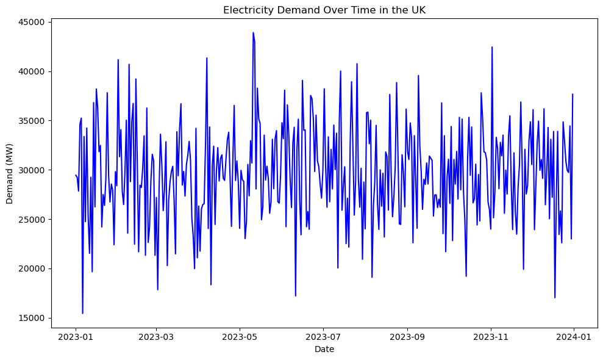
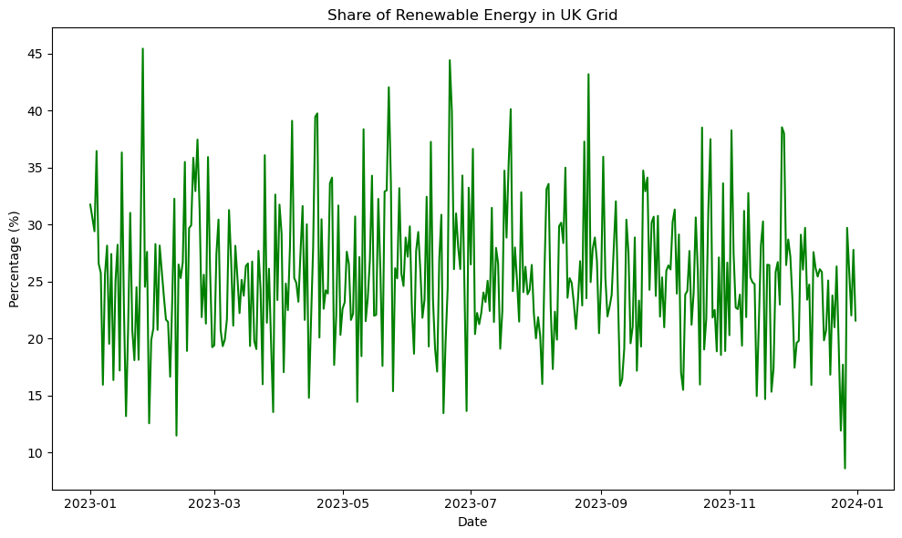
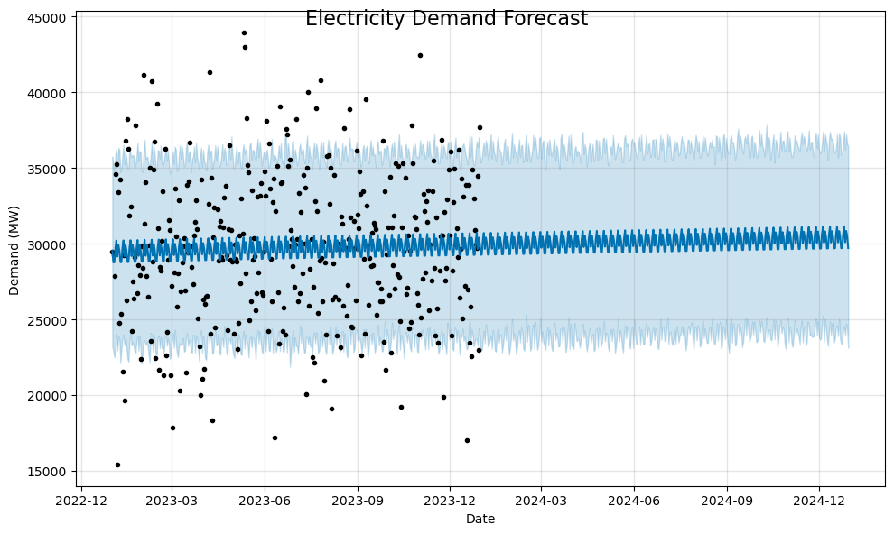
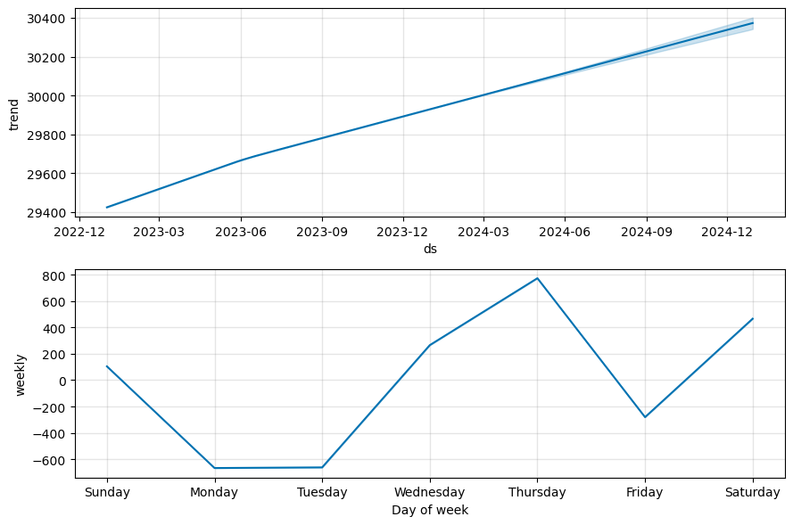

# UK Electricity Demand and Renewable Energy Share Analysis

## Introduction
This report analyzes electricity demand, renewable energy generation, and weather data in the UK using data obtained from the National Grid ESO and Met Office APIs. The analysis aims to:
1. Understand trends in electricity demand over time.
2. Evaluate the share of renewable energy in the UK grid.
3. Forecast future electricity demand using time series modeling.

---

## Data Sources
The analysis uses the following datasets:
- **Electricity Demand Data:** Obtained from the National Grid ESO API.
- **Renewable Generation Data:** Obtained from the National Grid ESO API.
- **Weather Data:** Obtained from the Met Office API.

The datasets were merged on the date column, and missing values were removed to ensure data quality.

---

## Key Findings

### 1. Electricity Demand Over Time

*Figure 1: Electricity demand trends in the UK over time.*

- **Trend:** The overall demand has remained relatively stable over the analyzed period, with slight fluctuations.
- **Seasonality:** Peaks in demand are observed during winter, while troughs occur in summer.

---

### 2. Share of Renewable Energy

*Figure 2: Share of renewable energy in the UK grid over time.*

- **Trend:** The renewable energy share has grown significantly, indicating a positive shift toward sustainable energy.
- **Seasonality:** The share of renewables fluctuates slightly, potentially due to variations in weather conditions affecting solar and wind generation.

---

### 3. Electricity Demand Forecast

*Figure 3: Forecast of electricity demand for the next 365 days.*

- **Trend:** The forecast suggests a stable demand trend, with no significant increase or decrease.
- **Seasonality:** The model captures the expected seasonal fluctuations, with higher demand in winter and lower demand in summer.

---

### 3. Forecast Components

*Figure 3: Forecast of electricity demand for the next 365 days.*
## Insights and Recommendations

### Insights
1. **Seasonal Demand Patterns:** Electricity demand is highly seasonal, with winter peaks and summer troughs. This pattern is consistent with historical data and is driven by heating and cooling needs.
2. **Growth in Renewables:** The increasing share of renewable energy in the UK grid is a positive indicator of the country's progress toward its net-zero targets.
3. **Stable Demand Forecast:** The forecast suggests that electricity demand will remain stable in the near future, with no significant upward or downward trends.

### Recommendations
1. **Energy Storage Solutions:** Invest in energy storage systems (e.g., batteries) to store excess renewable energy during low-demand periods and release it during peak demand.
2. **Demand-Side Management:** Implement demand-side management strategies to reduce peak demand, such as incentivizing off-peak electricity usage.
3. **Renewable Energy Expansion:** Continue investing in renewable energy infrastructure, particularly wind and solar, to further increase the share of renewables in the grid.

---

## Conclusion
This analysis provides valuable insights into the UK's electricity demand, renewable energy share, and future demand trends. The findings highlight the importance of addressing seasonal demand fluctuations and accelerating the transition to renewable energy sources. By leveraging these insights, policymakers and energy providers can make informed decisions to ensure a sustainable and reliable energy future for the UK.

---

## Limitations
1. **Data Availability:** The analysis is limited by the availability and granularity of data from the APIs.
2. **Weather Variability:** Weather conditions can significantly impact renewable energy generation and electricity demand, but the analysis does not account for long-term climate changes.
3. **Forecast Uncertainty:** While the Prophet model provides a reliable forecast, external factors (e.g., economic changes, policy shifts) could impact future demand.

---

## Future Work
1. **Incorporate Additional Data:** Include data on energy prices, population growth, and economic indicators to enhance the analysis.
2. **Advanced Forecasting:** Use machine learning models to improve the accuracy of demand forecasts.
3. **Regional Analysis:** Analyze electricity demand and renewable energy share at a regional level to identify localized trends and opportunities.

---

## How to Reproduce
1. Clone this repository.
2. Install the required dependencies (e.g., Python, pandas, matplotlib, Prophet).
3. Run the analysis script:
   ```bash
   python analysis_script.py
